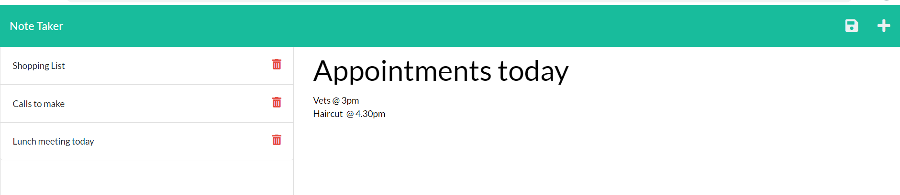

# Note Taker

The Note Taker application can be used to write and save notes. This application uses an Express.js back end and will save and retrieve note data from a JSON file.

The application’s front end had already been created, so the task for this week's homework was to build the back end, connect the two, and then deploy the entire application to Heroku.

Technologies used include javascript, express and node.js.

The acceptance criteria were as follows:

```
GIVEN a note-taking application
WHEN I open the Note Taker
THEN I am presented with a landing page with a link to a notes page

WHEN I click on the link to the notes page
THEN I am presented with a page with existing notes listed in the left-hand column, plus empty fields to enter a new note title and the note’s text in the right-hand column

WHEN I enter a new note title and the note’s text
THEN a Save icon appears in the navigation at the top of the page

WHEN I click on the Save icon
THEN the new note I have entered is saved and appears in the left-hand column with the other existing notes

WHEN I click on an existing note in the list in the left-hand column
THEN that note appears in the right-hand column

WHEN I click on the Write icon in the navigation at the top of the page
THEN I am presented with empty fields to enter a new note title and the note’s text in the right-hand column
```



The deployed application is available here: https://glacial-ridge-79087.herokuapp.com/
